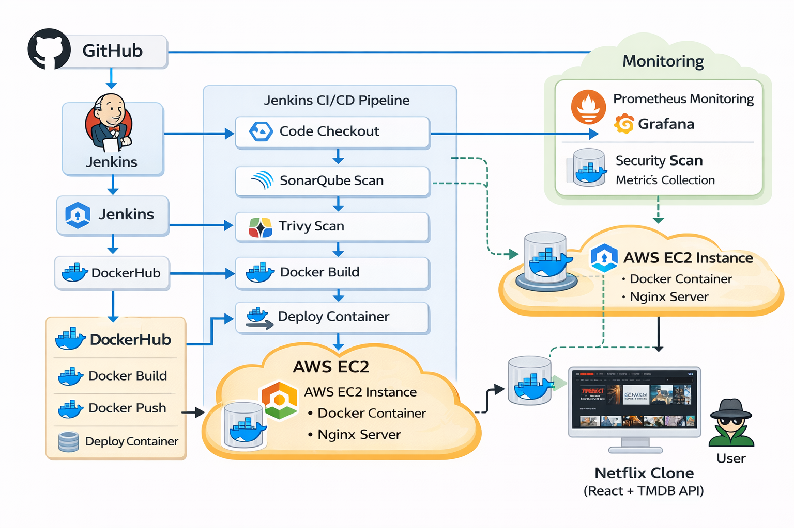
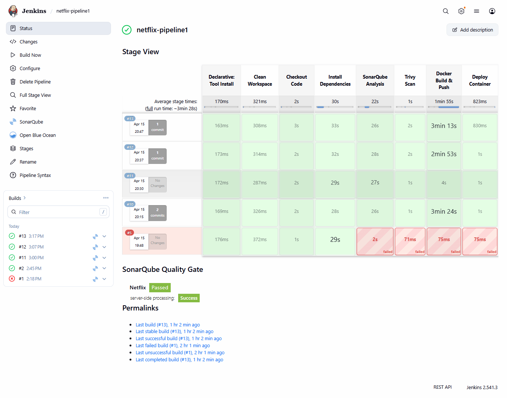
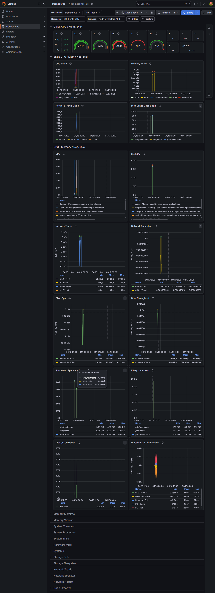
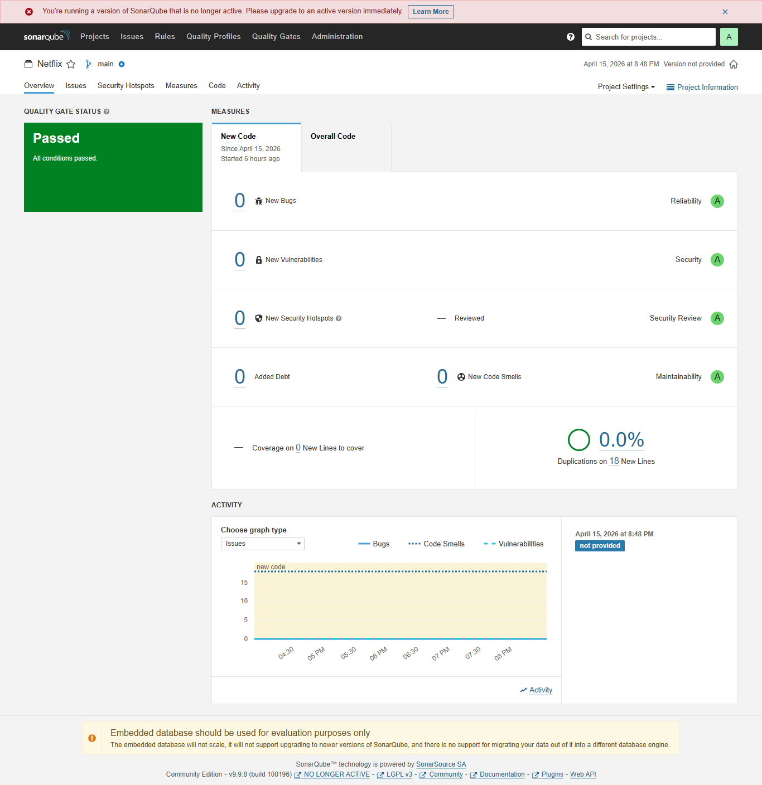

# 🚀 End-to-End DevSecOps CI/CD Pipeline on AWS

## 📌 Project Overview

This project demonstrates a **complete DevSecOps pipeline** for deploying a Netflix clone application using modern tools and best practices.

It covers:
- Continuous Integration (CI)
- Continuous Delivery (CD)
- Security Scanning
- Containerization
- Monitoring

---

## 🏗️ Architecture

### Architecture Diagram


---

🧩 Architecture Flow

```
                ┌──────────────┐
                │   Developer  │
                └──────┬───────┘
                       │
                       ▼
                ┌──────────────┐
                │   GitHub     │
                └──────┬───────┘
                       │ (Webhook)
                       ▼
                ┌──────────────┐
                │   Jenkins    │
                └──────┬───────┘
                       │
        ┌──────────────┼──────────────┐
        ▼                             ▼
┌──────────────┐              ┌──────────────┐
│ SonarQube    │              │   Trivy      │
│ Code Scan    │              │ Security     │
└──────────────┘              └──────────────┘
                       │
                       ▼
                ┌──────────────┐
                │   Docker     │
                │ Build Image  │
                └──────┬───────┘
                       │
                       ▼
                ┌──────────────┐
                │ DockerHub    │
                └──────┬───────┘
                       │
                       ▼
                ┌──────────────┐
                │   AWS EC2    │
                │  (Nginx)     │
                └──────┬───────┘
                       │
                       ▼
                ┌──────────────┐
                │   Users      │
                └──────────────┘

        Monitoring Stack:
        ┌──────────────┐
        │ Prometheus   │
        └──────┬───────┘
               ▼
        ┌──────────────┐
        │  Grafana     │
        └──────────────┘
```

---

## 🛠️ Tech Stack

| Category | Tools Used |
|--------|------------|
| CI/CD | Jenkins |
| Code Quality | SonarQube |
| Security | Trivy |
| Containerization | Docker |
| Monitoring | Prometheus, Grafana |
| Frontend | React (Netflix Clone) |
| Cloud | AWS EC2 |
| Web Server | Nginx |

---

## ⚙️ Pipeline Stages

### 🔹 1. Code Checkout
- Pulls source code from GitHub

### 🔹 2. Install Dependencies
- Runs `npm install`

### 🔹 3. Static Code Analysis
- SonarQube scans code quality and bugs

### 🔹 4. Security Scan
- Trivy scans Docker image for vulnerabilities

### 🔹 5. Docker Build & Push
- Builds Docker image
- Pushes to DockerHub

### 🔹 6. Deployment
- Runs container on EC2 using Nginx

---

## 🔐 Security Implementation

- Static Code Analysis using SonarQube
- Container Vulnerability Scanning using Trivy
- Identified and handled medium & high vulnerabilities

---

## 📊 Monitoring Setup

### 🔹 Prometheus
- Collects system and container metrics

### 🔹 Grafana
- Visualizes metrics via dashboards

### 📈 Metrics Monitored
- CPU usage
- Memory usage
- Disk utilization
- Container performance

---

## 🌐 Application

- Netflix Clone (React-based)
- Integrated with TMDB API
- Served via Nginx

---

## 🚀 How to Run

### 1. Clone Repository
```bash
git clone https://github.com/faizan-ab/Deploy-Netflix-Clone-on-Kubernetes.git
cd Deploy-Netflix-Clone-on-Kubernetes

2. Build Docker Image
docker build -t netflix .
3. Run Container
docker run -d -p 8081:80 netflix
4. Access Application
http://<your-ec2-ip>:8081
```

## 🧠 Challenges & Fixes

| Issue                            | Solution                    |
| -------------------------------- | --------------------------- |
| SonarQube connection timeout     | Fixed using localhost       |
| Docker build failure (yarn.lock) | Updated Dockerfile          |
| API not loading                  | Fixed environment variables |
| React routing 404                | Configured Nginx            |
| TypeScript build errors          | Handled build gracefully    |

## 📷 Screenshots

### Jenkins Pipeline


### Application


### Grafana Dashboard


### SonarQube


## 🎯 Key Learnings

Building real-world CI/CD pipelines
Debugging DevOps issues
Container security practices
Monitoring production systems
Handling environment configurations

## 🚀 Future Enhancements

Kubernetes Deployment (EKS)
Helm Charts
CI/CD optimization
Alerting system (Grafana alerts)


## 👨‍💻 Author

Faizan
⭐ Show Your Support
If you like this project, give it a ⭐ on GitHub!
