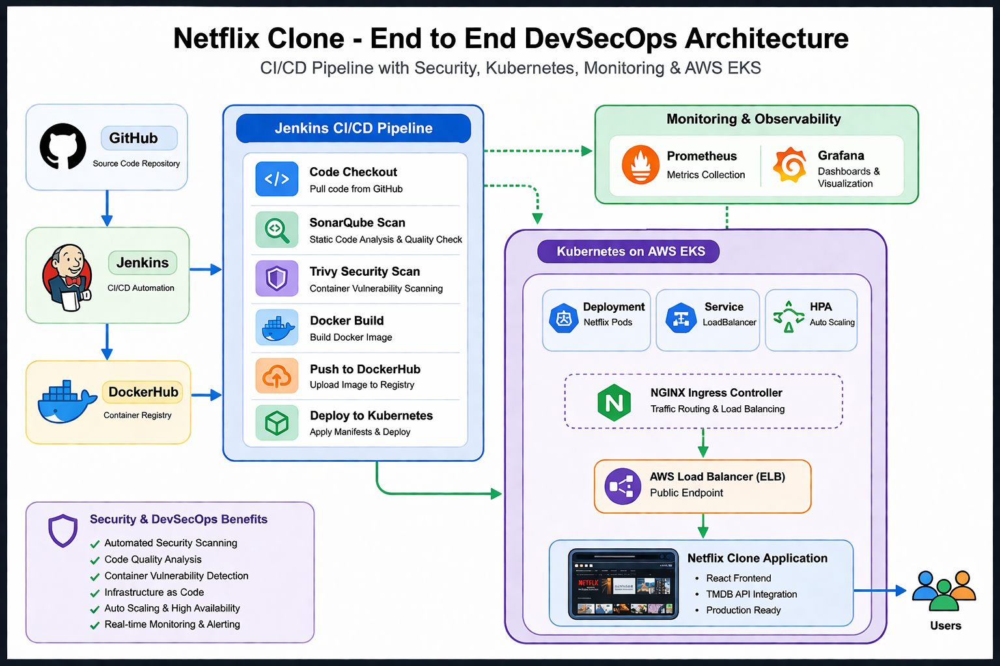
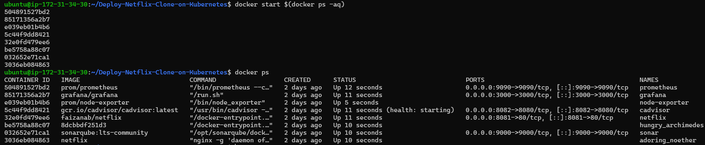
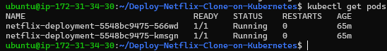
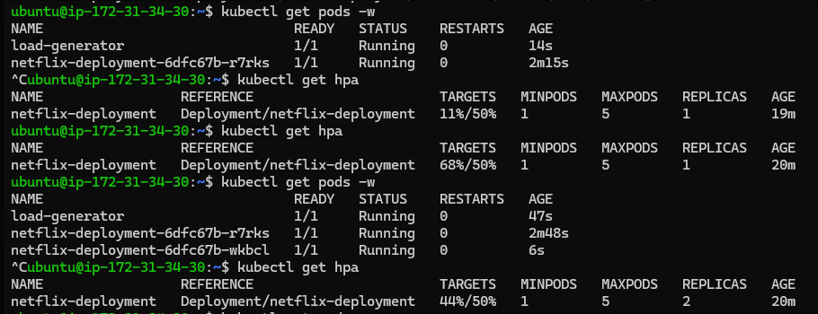
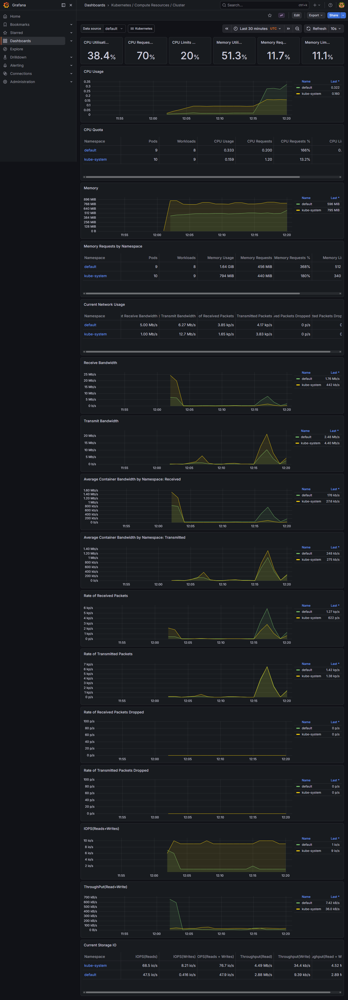
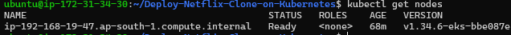
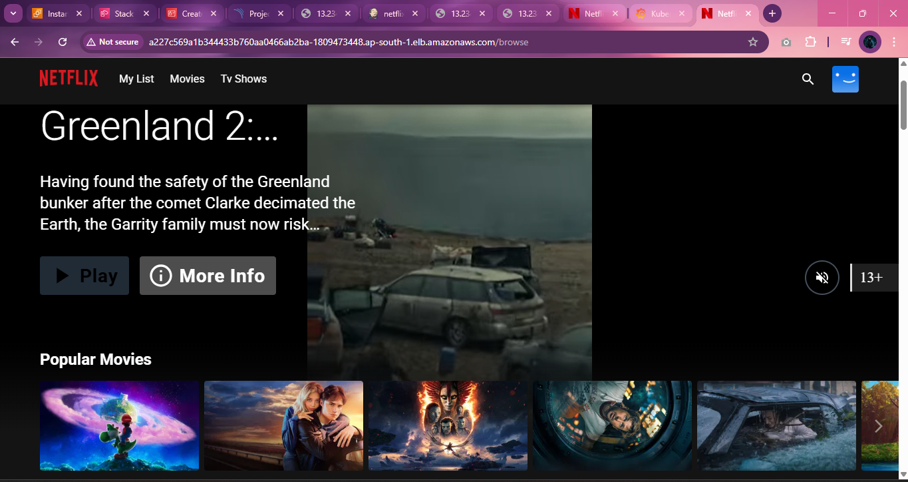

# 🚀 Netflix Clone – End-to-End DevSecOps Pipeline on Kubernetes & AWS EKS

## 📌 Project Overview

This project demonstrates a production-ready DevSecOps pipeline for deploying a Netflix clone application using modern cloud-native tools and best practices.

It covers the complete lifecycle:
- Continuous Integration (CI)
- Continuous Delivery (CD)
- Security Scanning
- Containerization
- Kubernetes Orchestration
- Monitoring & Observability
- Cloud Deployment on AWS EKS

---

## 🔥 Why This Project?

Unlike basic deployments, this project simulates real-world DevOps workflows:

✔ Automated CI/CD pipeline

✔ Integrated security scanning (DevSecOps)

✔ Kubernetes auto-scaling (HPA)

✔ Monitoring with Prometheus & Grafana

✔ Deployment on AWS EKS

✔ Public access via LoadBalancer & Ingress

---

## 🏗️ Architecture

### Architecture Diagram


---

🧩 Architecture Flow

```
                ┌──────────────┐
                │   Developer  │
                └──────┬───────┘
                       │
                       ▼
                ┌──────────────┐
                │   GitHub     │
                └──────┬───────┘
                       │ (Webhook)
                       ▼
                ┌──────────────┐
                │   Jenkins    │
                └──────┬───────┘
                       │
        ┌──────────────┼──────────────┐
        ▼                             ▼
┌──────────────┐              ┌──────────────┐
│ SonarQube    │              │   Trivy      │
│ Code Scan    │              │ Security     │
└──────────────┘              └──────────────┘
                       │
                       ▼
                ┌──────────────┐
                │   Docker     │
                │ Build Image  │
                └──────┬───────┘
                       │
                       ▼
                ┌──────────────┐
                │ DockerHub    │
                └──────┬───────┘
                       │
                       ▼
        ┌──────────────────────────────┐
        │ Kubernetes (Local Cluster)   │
        │ Deployment + Service + HPA   │
        └──────────────┬───────────────┘
                       │
                       ▼
        ┌──────────────────────────────┐
        │ Prometheus + Grafana         │
        │ Monitoring & Metrics         │
        └──────────────┬───────────────┘
                       │
                       ▼
        ┌──────────────────────────────┐
        │ AWS EKS Cluster              │
        │ Managed Kubernetes           │
        └──────────────┬───────────────┘
                       │
                       ▼
        ┌──────────────────────────────┐
        │ LoadBalancer (AWS ELB)       │
        └──────────────┬───────────────┘
                       │
                       ▼
        ┌──────────────────────────────┐
        │ Ingress (NGINX Controller)   │
        └──────────────┬───────────────┘
                       │
                       ▼
                ┌──────────────┐
                │    Users     │
                └──────────────┘
```

---

## 🛠️ Tech Stack

| Category         | Tools Used            |
| ---------------- | --------------------- |
| CI/CD            | Jenkins               |
| Code Quality     | SonarQube             |
| Security         | Trivy                 |
| Containerization | Docker                |
| Orchestration    | Kubernetes, AWS EKS   |
| Monitoring       | Prometheus, Grafana   |
| Cloud            | AWS (EKS, ELB)        |
| Web Server       | Nginx                 |
| Frontend         | React (Netflix Clone) |


---

## ⚙️ Pipeline Stages

###🔹 1. Code Checkout
-Pulls code from GitHub via webhook

###🔹 2. Install Dependencies
-Runs npm install

###🔹 3. Static Code Analysis
-SonarQube scans code quality & vulnerabilities

###🔹 4. Security Scan
-Trivy scans Docker image for vulnerabilities

###🔹 5. Docker Build & Push
-Builds image and pushes to DockerHub

###🔹 6. Deployment
-EC2 → Kubernetes → AWS EKS

---

## 🔐 ☸️ Kubernetes Implementation

- Deployment & Service setup
- NodePort → LoadBalancer exposure
- Ingress Controller (NGINX)
- Horizontal Pod Autoscaler (HPA)

---

## 📊 Monitoring Setup

###🔹 Prometheus
-Collects metrics from cluster and nodes

###🔹 Grafana
-Visualizes metrics via dashboards

### 📈 Metrics Monitored

- CPU usage
- Memory usage
- Pod performance
- Node health
- Auto-scaling behavior

---

## 🌐 Application Deployment

- Netflix Clone (React-based)
- Integrated with TMDB API
- Deployed on:
  -- Docker (Local)
  -- Kubernetes
  -- AWS EKS

---

## 🚀 🚀 How to Run

###🔹 Clone Repository
```
$git clone https://github.com/faizan-ab/Deploy-Netflix-Clone-on-Kubernetes.git
$cd Deploy-Netflix-Clone-on-Kubernetes
```

###🔹 Docker
```
$docker build -t netflix
$docker run -d -p 8081:80 netflix
```

###🔹 Kubernetes
```
$kubectl apply -f deployment.yaml
$kubectl apply -f service.yaml
```

###🔹 Enable Auto Scaling
```
$kubectl autoscale deployment netflix-deployment --cpu-percent=50 --min=1 --max=5
```

###🔹 Monitoring
```
$helm install monitor prometheus-community/kube-prometheus-stack
```

###🔹 AWS EKS
```
$eksctl create cluster --name netflix-cluster --region ap-south-1
```

###🔹 Ingress
```
$kubectl apply -f ingress.yaml
```
###🔹 Access Application

```
http://<your-ec2-ip>:8081
```


## 📷 Screenshots

### Jenkins Pipeline


### Application


### Grafana Dashboard


### SonarQube


### Docker Running Container


### Kubernetes Pods


### HPA Scaling


### Grafana Dashboard


### AWS EKS Nodes


### Application Live (EKS)


---

## 🧠 Challenges & Fixes

| Issue                | Solution                     |
| -------------------- | ---------------------------- |
| SonarQube timeout    | Fixed configuration          |
| Docker build issues  | Updated Dockerfile           |
| API not loading      | Fixed environment variables  |
| React routing 404    | Configured Nginx             |
| Pods Pending         | Fixed taints/resources       |
| Metrics server crash | Corrected args               |
| EKS node failure     | Used flexible instance types |
| Ingress DNS issues   | Fixed host configuration     |

---

## 🎯 Key Learnings

- End-to-end DevSecOps pipeline design
- Kubernetes deployment & scaling
- Monitoring production systems
- AWS EKS cluster management
- Debugging real-world DevOps issues

---

## 🚀 Future Enhancements

- Helm-based deployments
- CI/CD optimization
- Alerting (Grafana Alerts)
- Custom domain with Route53
- GitOps using ArgoCD

---

## 👨‍💻 Author

- Mohammed Abdul Faizan
- DevOps Enthuciast
- ⭐ Show Your Support
- If you like this project, give it a ⭐ on GitHub!
